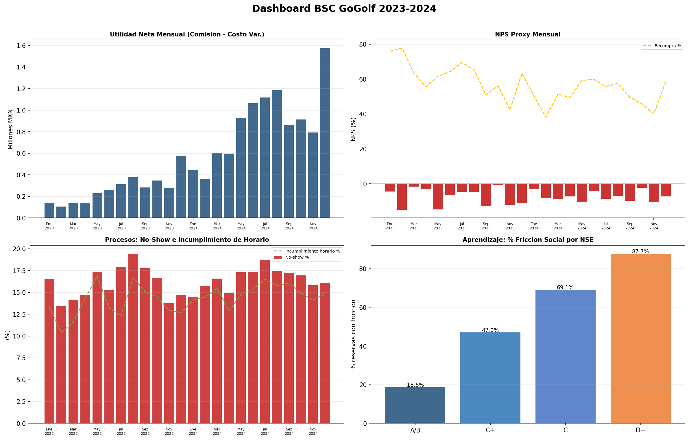
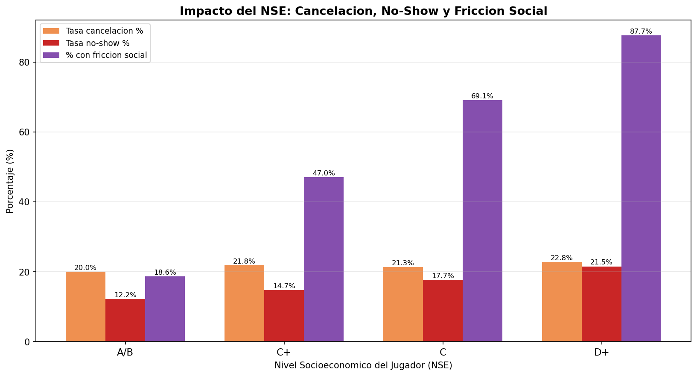
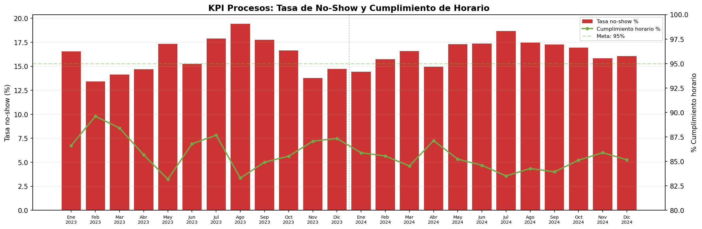
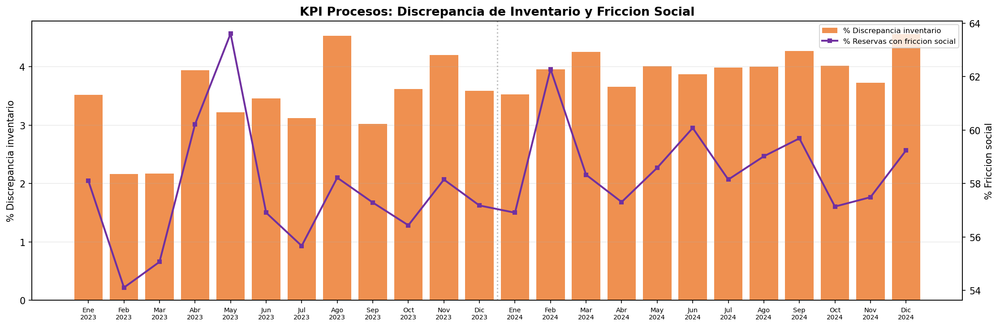
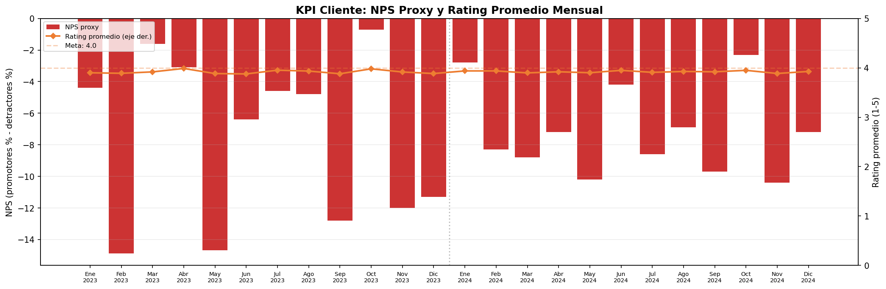
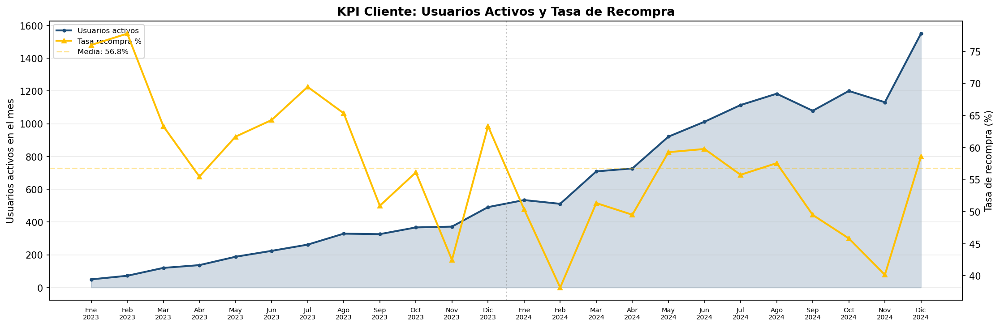
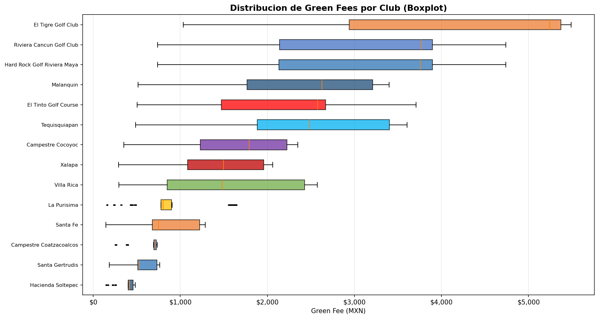
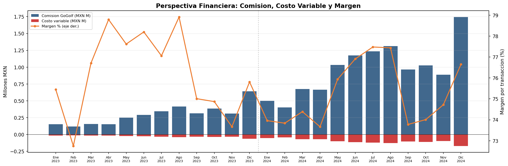
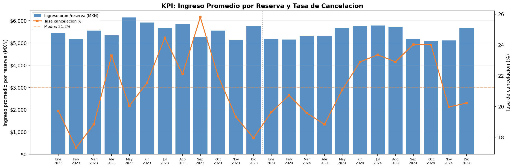

# GoGolf — Datamart Sintético y Dashboard Estratégico BSC

<p align="center">
  
</p>

> **GoGolf** ([gogolf.mx](https://gogolf.mx)) es una plataforma digital que democratiza el acceso a los campos de golf en México, conectando a jugadores no socios con clubes que aceptan reservas externas mediante el pago del green fee correspondiente.

---

## Nota sobre confidencialidad

> Debido a que GoGolf se encuentra actualmente en **fases críticas de levantamiento de capital y auditoría de procesos**, se ha optado por utilizar un **Entorno de Datos Sintéticos de Alta Fidelidad** para este análisis. Este modelo replica las distribuciones probabilísticas, estacionalidades y reglas de negocio reales de la plataforma, permitiendo proyectar metas estratégicas sin comprometer la confidencialidad transaccional de la compañía durante sus rondas de inversión.

Los precios de green fee y los 14 clubes son **reales**, extraídos directamente de gogolf.mx. Las distribuciones de lluvia provienen del **SMN/CONAGUA** y la segmentación socioeconómica sigue la **Regla NSE AMAI 2022**.

---

## Dashboard BSC Interactivo

```bash
pip install -r requirements.txt
streamlit run dashboard/app.py
```



---

## Hallazgos Estratégicos

Los hallazgos se presentan alineados con la lógica causa–efecto del Balanced Scorecard:
**Aprendizaje y Crecimiento → Procesos Internos → Cliente → Financiera**.

---

### 🌱 Perspectiva de Aprendizaje y Crecimiento

#### Hallazgo 1: La base de clientes es mayoritariamente NSE medio-bajo — la misión democratizadora funciona, pero genera fricción

El **53% de los jugadores registrados** pertenecen a los segmentos NSE C y D+, con ingresos familiares por debajo de $35,000 MXN/mes. GoGolf está atrayendo al perfil de usuario que declara querer servir: el jugador que desea acceder al golf sin ser socio de un club privado.

Sin embargo, el **58.1% de todas las reservas presentan al menos un evento de fricción social**: dress code no conocido, equipo propio requerido pero no disponible, handicap excedido, o insuficiente anticipación de reserva. Esta fricción es la causa raíz de los problemas en todas las perspectivas superiores del BSC.



| Tipo de fricción | Frecuencia |
|---|---|
| Dress code incumplido | Alta (clubes con requisito estricto: 4 de 14) |
| Equipo propio requerido | Media (5 clubes lo exigen) |
| Handicap excedido | Media (varía por club: 28–54 máx) |
| Discrepancia de inventario | 3.7% de reservas confirmadas |
| Anticipación insuficiente | Baja (2–3 días mínimo en 6 clubes) |

**Implicación estratégica:** La solución no es filtrar usuarios de NSE bajo, sino rediseñar el flujo de reserva para que el sistema haga el matching club-jugador antes de confirmar, mostrando solo clubes compatibles con el perfil del usuario.

---

### ⚙️ Perspectiva de Procesos Internos

#### Hallazgo 2: La tasa de no-show (16.3%) es el principal siniestro operativo — más del doble del benchmark sectorial

La tasa de no-show promedio mensual es **16.3%**, significativamente superior al 6–8% típico de plataformas de reserva turística consolidadas. El análisis de causas muestra que la **fricción social es el driver principal**, por encima incluso del clima adverso.



La **pérdida total estimada** por no-shows en el período 2023–2024 asciende a **$25.3 millones MXN** — cada slot vacío representa ingreso irrecuperable para el club y pérdida de comisión para GoGolf.

#### Hallazgo 3: El cumplimiento de horario (85.7%) y las discrepancias de inventario (3.7%) son fricciones del modelo marketplace

El cumplimiento de horario se ubica **14 puntos por debajo de la meta de 96%** definida en el BSC para el largo plazo. Las discrepancias entre el inventario digital y la disponibilidad real del club generan confirmaciones que el club no puede honrar — fricción crítica que destruye confianza en ambos lados del marketplace.



**Implicación estratégica:** Implementar una API en tiempo real con el sistema de reservas de cada club (en lugar de sincronización manual) reduciría las discrepancias de 3.7% a <1% en 12 meses.

---

### 👤 Perspectiva de Cliente

#### Hallazgo 4: El NPS negativo (-7.4) no es un problema de calidad de los campos — es un problema de expectativas no gestionadas

El **NPS proxy promedio es -7.4**, con más detractores que promotores en la base actual. Sin embargo, el rating promedio de los campos es **3.92/5.0** — los jugadores que logran completar una experiencia sin fricciones califican bien los clubes.



La divergencia entre NPS negativo y rating aceptable indica que el problema no es la calidad del golf, sino la **experiencia de reserva**: el jugador llega al club y encuentra requisitos que no conocía, o el horario no está disponible a pesar de la confirmación. El detractor no está insatisfecho con el campo — está insatisfecho con el proceso de GoGolf.

#### Hallazgo 5: La tasa de recompra del 56.8% es una señal positiva, pero está concentrada en NSE alto

La tasa de recompra promedio es **56.8%** — más de la mitad de usuarios activos reservan más de una vez al mes. Este es el activo más valioso de GoGolf: quienes superan la barrera inicial y tienen una buena experiencia regresan.



El problema es que esta recurrencia está concentrada en NSE A/B y C+. Los usuarios NSE C y D+ presentan tasas de recompra significativamente menores — no porque el golf no les guste, sino porque la probabilidad de fricción en cada reserva desincentiva el intento.

---

### 💰 Perspectiva Financiera

#### Hallazgo 6: El ingreso promedio por reserva ($2,302 MXN) oculta una segmentación de tres velocidades

La mediana de green fee es $2,050 MXN, pero la distribución tiene cola larga hacia los resorts de Quintana Roo y Nayarit ($3,800–$5,330), lo que eleva el promedio artificialmente. El **65% de las reservas son de campos de 18 hoyos** a precio estándar; el **25% son de 9 hoyos** (campos más accesibles, con green fee ~45% menor).



#### Hallazgo 7: El margen por transacción (75.7%) es sólido, pero los no-shows lo erosionan sistemáticamente

Con una comisión de 8–12% y costos variables de ~$45–$65 MXN por reserva, el margen operativo es atractivo. Sin embargo, cada no-show elimina la comisión del evento y genera costos de atención al cliente — reducir la tasa de no-show de 16.3% a <10% (meta a 12 meses) equivale a recuperar aproximadamente **$8–10M MXN en comisiones anuales**.



#### Hallazgo 8: La estacionalidad concentra el 40% del ingreso en 5 meses — riesgo de flujo de caja en temporada baja

Los meses de mayo–agosto y diciembre concentran la demanda. Febrero y noviembre registran las tasas de ocupación más bajas (<50%). La estrategia de pricing dinámico y alianzas corporativas en temporada baja es crítica para la estabilidad financiera del modelo.



---

## Metas SMART por Perspectiva (Resumen)

| Perspectiva | KPI | Baseline | Meta 6m | Meta 12m | Meta 24m |
|---|---|---|---|---|---|
| 💰 Financiera | Ingreso prom/reserva | $2,302 | $2,417 | $2,578 | $2,878 |
| 💰 Financiera | Margen por transacción | 75.7% | 78.7% | 81.7% | 85.7% |
| 💰 Financiera | Tasa de cancelación | 21.2% | <18% | <16% | <14% |
| 👤 Cliente | NPS proxy | -7.4 | >0 | >+10 | >+20 |
| 👤 Cliente | Tasa de recompra | 56.8% | >62% | >67% | >72% |
| 👤 Cliente | Rating promedio | 3.92 | >4.0 | >4.2 | >4.5 |
| ⚙️ Procesos | % Cumplimiento horario | 85.7% | >90% | >93% | >96% |
| ⚙️ Procesos | % Discrepancia inventario | 3.7% | <2.8% | <1.9% | <0.9% |
| ⚙️ Procesos | Tasa de no-show | 16.3% | <13% | <11% | <9% |
| 🌱 Aprendizaje | % Fricción social | 58.1% | <49% | <41% | <29% |
| 🌱 Aprendizaje | % Decisiones con análisis | ~30% | >50% | >70% | >85% |
| 🌱 Aprendizaje | Tiempo impl. mejoras (días) | ~45 | <35 | <25 | <15 |

---

## Estructura del Repositorio

```
golf_simulation_data/
│
├── data/
│   ├── raw/                       # Tablas del datamart (dims + facts)
│   │   ├── dim_club.csv               # 14 clubes reales de gogolf.mx
│   │   ├── dim_campo.csv              # Tipos de campo con multiplicador de precio
│   │   ├── dim_fecha.csv              # Calendario 2023-2024 (temporada, festivos)
│   │   ├── dim_jugador.csv            # 2,000 perfiles con NSE, handicap, canal
│   │   ├── fact_reservas.csv          # ~27K reservas con fricción y lluvia
│   │   ├── fact_cancelaciones.csv     # Motivo, tipo y penalización
│   │   ├── fact_noshow.csv            # Pérdida estimada y causa principal
│   │   ├── fact_fricciones.csv        # Eventos granulares de fricción social
│   │   ├── fact_ratings.csv           # 5 aspectos + categoría NPS
│   │   ├── inventario_clubes.csv      # Snapshot mensual de ocupación
│   │   └── gogolf_campos_reales.csv   # Datos scrapeados de gogolf.mx
│   │
│   └── processed/
│       └── kpi_bsc_mensual.csv        # KPIs BSC precalculados (24 periodos)
│
├── src/
│   ├── 00_scraper_gogolf.py           # Scraper Playwright para gogolf.mx
│   ├── 01_generar_datos.py            # Generador del datamart sintético
│   ├── 02_analisis_descriptivo.py     # Análisis + gráficas estáticas
│   └── 03_generar_word.py             # Generador del reporte
│
├── dashboard/
│   └── app.py                         # Dashboard Streamlit BSC (6 tabs)
│
├── assets/                            # Gráficas embebidas en este README
├── requirements.txt
└── README.md
```

---

## Reproducción

```bash
# 1. Instalar dependencias
pip install -r requirements.txt
playwright install chromium

# 2. Regenerar el datamart (semilla fija, 100% reproducible)
python src/01_generar_datos.py

# 3. Correr el dashboard
streamlit run dashboard/app.py

# 4. Regenerar gráficas estáticas
python src/02_analisis_descriptivo.py
```

---

## Diseño del Datamart — Esquema Estrella

```
dim_fecha ──┐
dim_club  ──┤
dim_campo ──┼──► fact_reservas ──► fact_cancelaciones
dim_jugador─┘         │
                       ├──► fact_noshow
                       ├──► fact_ratings
                       └──► fact_fricciones

dim_club ──► inventario_clubes
fact_reservas (agregado) ──► kpi_bsc_mensual  [data/processed]
```

---

## Fuentes de Datos

| Fuente | Uso |
|---|---|
| [gogolf.mx](https://gogolf.mx) (Playwright scraping) | 14 clubes con green fees reales y requisitos de entrada |
| SMN / CONAGUA | Probabilidad de lluvia mensual por región (9 regiones) |
| AMAI 2022 (Regla NSE) | Distribución socioeconómica: AB 12%, C+ 35%, C 38%, D+ 15% |
| Benchmarks sector marketplace | Tasas de cancelación, NPS y recompra de referencia |

---

*Proyecto MNA — Análisis Estratégico GoGolf 2023–2024*
